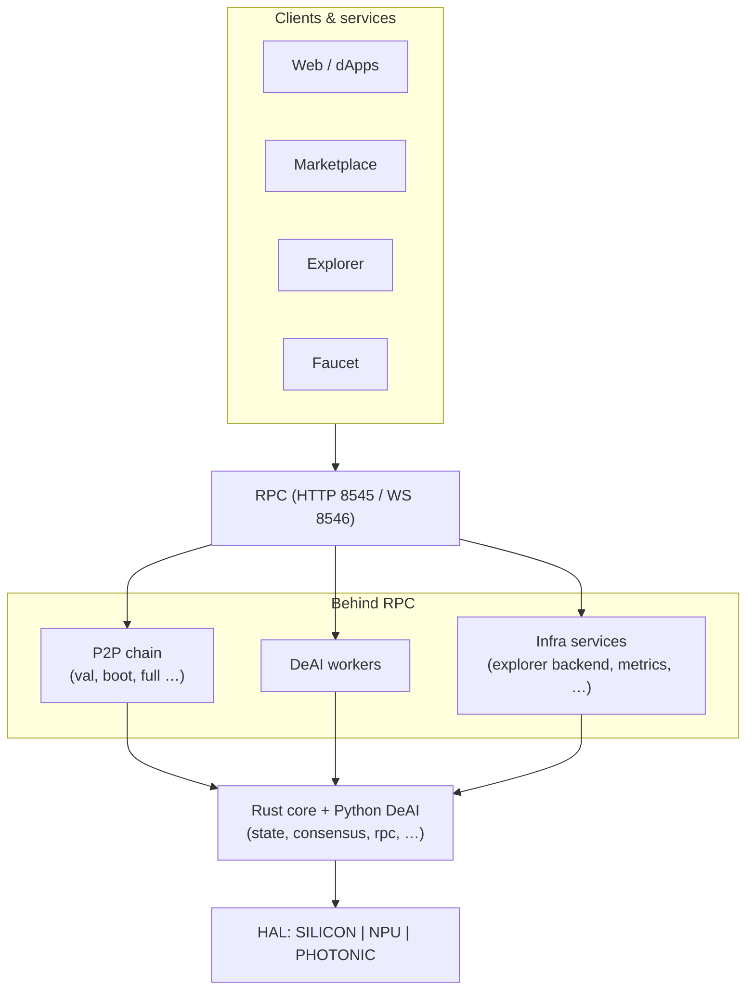

# Architecture Overview — Axionax Core Universe

Single entry point for **how the protocol is structured** in this repository: layers from users down to hardware, where code lives, and which docs to read next.

**Audience:** engineers onboarding to `axionax-core-universe`, reviewers, and operators who need a map before diving into RPC specs or runbooks.

---

## Contents

1. [Purpose & scope](#1-purpose--scope)  
2. [System stack](#2-system-stack)  
3. [Repository layout](#3-repository-layout)  
4. [Rust workspace (crates)](#4-rust-workspace-crates)  
5. [Network & node roles](#5-network--node-roles)  
6. [Consensus architecture (PoPC)](#6-consensus-architecture-popc)  
7. [Economic layer](#7-economic-layer)  
8. [DeAI & compute](#8-deai--compute)  
9. [Hardware program (Monolith)](#9-hardware-program-monolith)  
10. [Product vision (pointer)](#10-product-vision-pointer)  
11. [Performance characteristics](#11-performance-characteristics)  
12. [Production code & deployment readiness](#12-production-code--deployment-readiness)  
13. [Related documentation](#13-related-documentation)

---

## 1. Purpose & scope

| In scope here | Out of scope (see linked docs) |
|-----------------|--------------------------------|
| Logical layers and data flow | Every JSON-RPC method → [RPC_API.md](./RPC_API.md) |
| Folder ↔ responsibility | VPS runbooks, genesis day → repo `docs/`, [RUNBOOK.md](./RUNBOOK.md) |
| List of Rust workspace crates | Full API signatures → [API_REFERENCE.md](./API_REFERENCE.md) |
| **Production readiness checklist** | [§9](#9-production-code--deployment-readiness) + linked runbooks / audit docs |

Canonical doc index for the whole repo: [AXIONAX_BIBLE.md](../../docs/AXIONAX_BIBLE.md).

---

## 2. System stack

Traffic flows **down** from clients; trust and execution anchor in **Rust core**, with **Python DeAI** for off-chain / worker compute and **HAL** for hardware backends.

### 2.1 Layer summary

| # | Layer | Responsibility |
|---|--------|----------------|
| L1 | **Clients** | Web, dApps, wallets, marketplace UIs |
| L2 | **Edge services** | Explorer (e.g. Blockscout), faucet, monitoring (Prometheus/Grafana) |
| L3 | **RPC** | JSON-RPC (HTTP/WebSocket); Ethereum-style and custom methods |
| L4 | **Chain & P2P** | Validators, bootnodes, full/light nodes; sync and block production |
| L5 | **Core (Rust)** | State, consensus, mempool, staking, governance, genesis, metrics |
| L6 | **DeAI (Python)** | Worker node, marketplace integration, optional optical / ML paths |
| L7 | **HAL** | SILICON (CPU/GPU), NPU (e.g. Hailo), PHOTONIC (simulation / roadmap) |

### 2.2 Ecosystem diagram

```
                         AXIONAX ECOSYSTEM (clients & services)
┌────────────┐ ┌────────────┐ ┌────────────┐ ┌────────────┐
│ Web / dApps│ │ Marketplace│ │ Explorer   │ │ Faucet     │
└─────┬──────┘ └─────┬──────┘ └─────┬──────┘ └─────┬──────┘
      └──────────────┴──────────────┴──────────────┘
                              │
                              ▼
                   ┌──────────────────────┐
                   │ RPC (8545 / 8546)    │
                   └──────────┬───────────┘
         ┌────────────────────┼────────────────────┐
         ▼                    ▼                    ▼
   ┌───────────┐        ┌───────────┐        ┌─────────────────┐
   │ P2P chain │        │ DeAI      │        │ Infra services  │
   │ (val,     │        │ workers   │        │ (explorer,      │
   │  boot,    │        │           │        │  metrics, etc.) │
   │  full…)   │        │           │        └─────────────────┘
   └─────┬─────┘        └─────┬─────┘
         └────────────────────┘
                              ▼
              ┌───────────────────────────────┐
              │ Rust core + Python DeAI       │
              │ (state, consensus, rpc, …)    │
              └───────────────┬───────────────┘
                              ▼
              ┌───────────────────────────────┐
              │ HAL: SILICON │ NPU │ PHOTONIC │
              └───────────────────────────────┘
```

*Tip: use a **monospace** font in the editor so column alignment matches the diagram.*

### 2.3 Same diagram (Mermaid — renders on GitHub / many Markdown viewers)



---

## 3. Repository layout

Top-level map of **this monorepo** (paths relative to repo root).

| Path | Role |
|------|------|
| `core/` | **Cargo workspace root** — protocol crates under `core/core/`, `core/deai/`, `core/bridge/`, `core/tools/` |
| `core/deai/` | Python worker, HAL, RPC client helpers, tests |
| `core/photonic/` | Photonic / MK-II research notes (not a Cargo workspace member) |
| `ops/deploy/` | Dockerfiles, compose, nginx, monitoring, **public testnet:** `environments/testnet/public/` |
| `scripts/` | Readiness scripts, `load_test/`, optimize suite, security helpers |
| `docs/` | Launch, MetaMask, readiness, [AXIONAX_BIBLE.md](../../docs/AXIONAX_BIBLE.md) |
| `reports/` | Generated readiness / benchmark outputs (when committed or local) |
| `configs/` | Monolith / HYDRA sentinel & worker TOML examples |
| `tools/` | Root-level devtools (Python, analysis) |
| `hydra_manager.py` | HYDRA dual-core controller (MK-I tooling) |

**Build tip:** Node binary is built from workspace package `node` → `axionax-node`. Image build: `ops/deploy/Dockerfile` with context `core/`.

---

## 4. Rust workspace (crates)

Defined in `core/Cargo.toml`: **18 protocol crates** in `core/core/`, plus **`bridge/rust-python`** and **`tools/faucet`**.

### 4.1 Protocol & execution

| Crate | Role |
|-------|------|
| `blockchain` | Blocks, chain, mempool integration |
| `consensus` | PoPC; Proof-of-Light (simulation) |
| `crypto` | Primitives; **ECVRF** (schnorrkel) on production VRF paths |
| `network` | libp2p, gossip, capabilities (ASR / Monolith hints) |
| `state` | Persistent state (e.g. RocksDB) |
| `node` | Binary `axionax-node` — wires network, state, RPC, roles |
| `rpc` | JSON-RPC server, health, metrics hooks |
| `config` | Configuration loading |

### 4.2 Economics & coordination

| Crate | Role |
|-------|------|
| `staking` | Stake, delegate, slash |
| `governance` | Proposals, voting |
| `ppc` | Posted Price Controller (compute pricing) |
| `da` | Data availability (erasure coding) |
| `asr` | Auto-Selection Router (VRF-weighted worker selection) |
| `vrf` | VRF interfaces; prefer ECVRF stack in new code |

### 4.3 Observability, tooling & integration

| Crate | Role |
|-------|------|
| `events` | Event bus, subscriptions, history (VecDeque) |
| `metrics` | Prometheus metrics, monitoring hooks |
| `http_health` | Health endpoints (/health, /ready, /metrics, /version) |
| `genesis` | Genesis block generation, state seeding |
| `cli` | Command-line interface, node management |

### 4.4 Bridge & tools

| Crate | Role |
|-------|------|
| `bridge/rust-python` | PyO3 bridge for DeAI worker integration |
| `tools/faucet` | Testnet faucet (HTTP API) |


### 4.5 Monitoring & operations tools

| Tool | Location | Purpose |
|------|----------|---------|
| **Rate Limiting Dashboard** | `ops/scripts/rate_limit_dashboard.py` | Real-time rate limiting monitoring |
| **Health Monitor** | `ops/scripts/health_monitor.py` | Automated health checks with alerts |
| **RPC Benchmark** | `ops/scripts/rpc_benchmark.py` | Performance testing and load testing |
| **Validator Monitor** | `ops/scripts/validator_monitor.py` | Validator coordination and fork detection |

---

## 5. Network & node roles

- **Chain participants:** validator, bootnode, full node, light node (as implemented).  
- **Off-chain / ops:** dedicated RPC service, explorer backend, faucet, monitoring.

Authoritative list and responsibilities: [NETWORK_NODES.md](./NETWORK_NODES.md).  
Sizing (CPU/RAM/disk): [NODE_SPECS.md](./NODE_SPECS.md).

---

## 6. Consensus architecture (PoPC)

Axionax uses **Proof-of-Probabilistic-Checking (PoPC)** as its primary consensus mechanism, purpose-built for verifying DeAI compute jobs without re-executing the full workload.

### 6.1 PoPC vs traditional consensus

| Aspect | PoPC | PoW | PoS |
|--------|------|-----|-----|
| **Energy usage** | ✅ Low | ❌ High | ✅ Low |
| **Verification** | ✅ Probabilistic sampling | ✅ Full re-execution | ✅ Economic voting |
| **Primary use case** | ✅ DeAI job verification | General compute | General compute |
| **Fraud detection** | ✅ Statistical (>99%) | N/A | Economic slashing |
| **Block finality** | ⚠️ In progress | Immediate | Fast |

### 6.2 PoPC flow

```
┌──────────────┐   submit result   ┌──────────────────────┐
│  DeAI Worker │ ─────────────────▶│  Consensus Engine    │
└──────────────┘                   │                      │
                                   │  1. Receive job_id + │
                                   │     Merkle root      │
                                   │  2. Generate VRF     │
                                   │     seed (ECVRF)     │
                                   │  3. Sample N indices │
                                   │     (SHA3-256)       │
                                   └──────────┬───────────┘
                                              │ challenge
                                              ▼
                                   ┌──────────────────────┐
                                   │  Worker responds     │
                                   │  with Merkle proofs  │
                                   │  for sampled chunks  │
                                   └──────────┬───────────┘
                                              │ proofs
                                              ▼
                                   ┌──────────────────────┐
                                   │  verify_sample_proofs│
                                   │  → all pass: ✅ VALID │
                                   │  → any fail: ❌ FRAUD │
                                   └──────────────────────┘
```

### 6.3 Key parameters

| Parameter | Value | Rationale |
|-----------|-------|-----------|
| `sample_size` | 1000 | Detects 1% fraud with >99.99% probability |
| `min_confidence` | 0.99 | 99% detection required |
| `fraud_window_blocks` | `3600 / block_time` | ~1 hour fraud challenge window |
| `min_validator_stake` | 1,000,000 tokens | Economic security threshold |
| `false_pass_penalty_bps` | 500 bps (5%) | Penalty for passing bad proofs |

### 6.4 Fraud detection probability

For a job with fraud rate `f` and sample size `n`:

```
P(detect) = 1 - (1 - f)^n

Examples:
  f=1%,  n=1000 → P=99.996%
  f=5%,  n=1000 → P=~100%
  f=0.1%, n=1000 → P=63.2%  (use larger sample for low fraud rates)
```

### 6.5 Block production & validator selection

Block production is separate from PoPC job verification:

```
  Every block_time_seconds:
    1. Validator selection  → round-robin by PeerId hash
    2. Transaction gather   → mempool.get_pending(100)
    3. Block construction   → hash(parent ‖ number ‖ timestamp)
    4. Gossipsub broadcast  → NetworkMessage::Block to all peers
    5. Peer receipt         → validate → store in StateDB
```

### 6.6 Proof-of-Light (simulation layer)

Monolith Mark-II hardware will replace SHA3 sampling with **photonic interference**:

| Layer | Current (software) | Mark-II (hardware) |
|-------|--------------------|---------------------|
| Randomness | SHA3-256 + VRF seed | Quantum optical noise |
| Verification | CPU Merkle check | Photonic interference mesh |
| Speed | ms | ~picosecond |
| Security | Cryptographic | Quantum physics |

Simulation code: `core/core/consensus/src/proof_of_light.rs`

---

## 7. Economic layer

### 7.1 Token economics overview

| Component | Status | Description |
|-----------|--------|-------------|
| **Staking** | ✅ Implemented | Validators lock tokens to participate |
| **Slashing** | ✅ Implemented | Penalty on self-stake for misbehavior (max 50%) |
| **Block rewards** | 🔄 Planned | Proposer receives token reward per block |
| **Transaction fees** | 🔄 Planned | Gas-based fees distributed to validators |
| **PoPC rewards** | 🔄 Planned | Validators earn for correct challenge verification |

### 7.2 Staking mechanics

```
Minimum stake: 1,000,000 tokens
Slash rate: up to 50% of self-stake (5000 bps max)
Slash basis: self-stake only (NOT voting power)
Unstake: requires unbonding period (configurable)
```

### 7.3 Governance

| Parameter | Constraint |
|-----------|------------|
| Proposal title | max 256 characters |
| Proposal description | max 10,000 characters |
| Voting | Stake-weighted |
| Execution | On-chain after quorum |

### 7.4 Fork resolution (chain selection)

Current rule: **longest chain** — the node accepts the block that extends the highest known block number. On tie, first-seen wins.

```
  Incoming block:
    if block.number > local_height  → accept, extend chain
    if block.number == local_height → reject (already have block at this height)
    if already stored (by hash)     → deduplicate, ignore
```

> **Roadmap:** Full GHOST-protocol fork choice and validator 2/3 finality confirmation.

---

## 8. DeAI & compute

| Component | Location / note |
|-----------|------------------|
| Worker process | `core/deai/worker_node.py` — jobs: inference, training, data processing |
| HAL | `core/deai/compute_backend.py` — **SILICON**, **NPU**, **PHOTONIC**, **HYBRID** |
| Marketplace | Contract-facing flows (register, jobs, results) — see DeAI docs |
| Worker selection | Rust **ASR** + **VRF** on-chain / protocol side |

Worker taxonomy: [MARKETPLACE_WORKER_NODES.md](./MARKETPLACE_WORKER_NODES.md).

---

## 9. Hardware program (Monolith)

| Gen | Codename | Focus | In repo (typical) |
|-----|----------|--------|-------------------|
| MK-I | Vanguard / Origin | Silicon + NPU (e.g. Hailo, RPi class) | HAL, HYDRA configs |
| MK-II | Prism | Path to photonic; simulation | Optical / PoL simulation code paths |
| MK-III | Ethereal | Photonic scale-out | Roadmap |
| MK-IV | Gaia | Long-term vision | Roadmap |

Detail: [MONOLITH_ROADMAP.md](./MONOLITH_ROADMAP.md).

---

## 10. Product vision (pointer)

High-level narrative (pillars, engines, phases): [PROJECT_ASCENSION.md](./PROJECT_ASCENSION.md).  
Security framing (Sentinels, self-sufficiency): [SENTINELS.md](./SENTINELS.md), [SELF_SUFFICIENCY.md](../../docs/SELF_SUFFICIENCY.md).

---

## 11. Performance characteristics

### 11.1 Current benchmarks (testnet)

| Component | Throughput | Latency (p95) | Notes |
|-----------|------------|---------------|-------|
| RPC server | ~1,000 req/s | <10ms | Rate-limited via tower |
| P2P gossip | ~10 MB/s | <100ms | Gossipsub |
| Block production | 1 block / `block_time_secs` | N/A | Default 5s, configurable |
| StateDB reads | ~5,000 tx/s | <5ms | RocksDB |
| PoPC sampling | 1,000 indices | <1ms | SHA3-256 deterministic |
| Merkle proof verify | per challenge | <10ms | All samples verified |

### 11.2 Resource targets (per validator node)

| Resource | Recommended | Limit (Docker) |
|----------|-------------|----------------|
| CPU | 2 cores | `cpus: 2.0` |
| Memory | 2 GB | `mem_limit: 2g` |
| Disk | 50 GB SSD | — |
| Network | 100 Mbps | — |

### 11.3 Benchmarking tools

```bash
# RPC performance under load
python ops/scripts/rpc_benchmark.py --rpc http://127.0.0.1:8545

# Block-time / TPS probes
python scripts/load_test/tps_finality_test.py --mode block-time

# Multi-validator coordination
python ops/scripts/validator_monitor.py \
  --rpc http://val1:8545 http://val2:8545 --duration 10
```

---

## 12. Production code & deployment readiness

This section maps **how “production-ready” is defined in this repo** and where to verify it. It is **not** a legal guarantee or mainnet go-live sign-off.

### 12.1 Definitions

| Term | Meaning here |
|------|----------------|
| **Production-grade testnet** | Chain + RPC + supporting services behave in a **stable, observable** way suitable for sustained testing (consensus alignment, RPC health, basic SLOs). Criteria: [TESTNET_PRODUCTION_READINESS.md](../../docs/TESTNET_PRODUCTION_READINESS.md). |
| **Mainnet production** | Separate genesis (chain ID **86150**), keys, infra, and **audit / governance** gates — see [MAINNET_PRODUCTION_PLAN.md](../../docs/MAINNET_PRODUCTION_PLAN.md). Not implied by testnet readiness alone. |

### 12.2 Build & quality gates (code)

| Area | What to run / expect |
|------|----------------------|
| **Rust release binary** | From `core/`: `cargo build --release -p node` → `axionax-node` (used in Docker and VPS scripts). |
| **CI** | Root [`.github/workflows/ci.yml`](../../.github/workflows/ci.yml): fmt, clippy, tests, audit (paths under `core/`). |
| **Python (DeAI)** | From `core/deai/`: `pytest`; use env-based secrets, not committed keys ([`core/deai/README.md`](../deai/README.md) patterns). |
| **Docker image** | [`ops/deploy/Dockerfile`](../../ops/deploy/Dockerfile), build context **`core/`** — matches public testnet redeploy flow. |

### 12.3 Automated checks (operators & integrators)

| Script / artifact | Purpose |
|-------------------|---------|
| `scripts/check_testnet_production_readiness.py` | Validates chain ID, heights, optional multi-validator consensus, public RPC lag, faucet HTTP — writes `reports/TESTNET_PRODUCTION_READINESS_LAST.md`. |
| `scripts/load_test/tps_finality_test.py` | Block-time / TPS-style probes against JSON-RPC (`--mode block-time` needs no funded key). |
| `scripts/verify-production-ready.py` | Broader readiness sweep (see root [README.md](../../README.md) tooling table). |
| `ops/scripts/rate_limit_dashboard.py` | Real-time rate limiting and network metrics dashboard. |
| `ops/scripts/health_monitor.py` | Continuous health monitoring with alerting and SLO tracking. |
| `ops/scripts/rpc_benchmark.py` | RPC performance testing under load with rate limiting validation. |
| `ops/scripts/validator_monitor.py` | Multi-validator coordination monitoring and fork detection. |
| `scripts/optimize_suite/` | Performance / tuning experiments (not a single PASS/FAIL for launch). |

### 12.4 Deployment surface (runtime)

| Path | Role |
|------|------|
| `ops/deploy/environments/testnet/public/` | **Canonical** public testnet Compose, env templates, `scripts/redeploy_testnet.sh`. |
| `ops/deploy/monitoring/` | Prometheus / Grafana patterns for node and infra metrics. |
| `core/docs/RUNBOOK.md` | Operational procedures (restarts, incidents). |

Operational hardening (firewall, TLS, rate limits, backups) is **environment-specific** — see deploy docs under `ops/deploy/` and [NODE_SPECS.md](./NODE_SPECS.md).

### 12.5 Security & audit (honest posture)

| Resource | Status |
|----------|--------|
| [SECURITY_AUDIT_REPORT.md](../../SECURITY_AUDIT_REPORT.md) | ✅ **All 97 findings addressed** (P0, P1, P2, P3 core) |
| [SECURITY_REMEDIATION_PLAN.md](../../SECURITY_REMEDIATION_PLAN.md) | ✅ **Complete** - only P3-T8 (frontend) remains |
| [AUDIT_REPORT_PRELIMINARY.md](../../docs/AUDIT_REPORT_PRELIMINARY.md) | Supplementary audit notes. |

**Key security improvements (Mar 2026):**
- ✅ RPC rate limiting & CORS middleware
- ✅ Input validation (proposals, subscriptions, duplicate txs)
- ✅ Secure keystore handling & Python sandbox guards
- ✅ Docker hardening (resource limits, log rotation)
- ✅ Memory safety (saturating arithmetic, safe unwraps)
- ✅ Network security (gossipsub strict validation, TLS) |

**Code hygiene:** prefer no `unwrap()` / `expect()` on hot protocol paths; follow workspace [rust-core](../../.cursor/rules/rust-core.mdc) conventions in new changes.

### 12.6 Summary status (high level)

| Layer | Readiness (Mar 2026) |
|-------|-------------------|
| **Node + RPC (testnet)** | ✅ **80-85% production-grade** - All security fixes complete, validator coordination implemented, monitoring tools added |
| **DeAI worker** | ✅ Production-hardened (sandbox guards, secure keystore, dependency pinning) |
| **Mainnet** | Planned; requires dedicated genesis, key ceremony, and final frontend security (P3-T8) |

**Recent improvements:**
- ✅ Validator selection logic (round-robin) prevents fork conflicts
- ✅ Advanced health endpoints (/version, enhanced metrics)
- ✅ Monitoring suite (rate limiting dashboard, health monitor, RPC benchmark)
- ✅ Docker resource limits and log rotation
- ✅ Memory safety and overflow protection throughout |

---

## 13. Related documentation

### Protocol & nodes

| Doc | Topic |
|-----|--------|
| [NETWORK_NODES.md](./NETWORK_NODES.md) | Node types |
| [NODE_SPECS.md](./NODE_SPECS.md) | Hardware sizing |
| [RPC_API.md](./RPC_API.md) | JSON-RPC catalog |
| [API_REFERENCE.md](./API_REFERENCE.md) | Deeper API reference |

### Security & operations

| Doc | Topic |
|-----|--------|
| [RUNBOOK.md](./RUNBOOK.md) | Incidents, restarts |
| [SENTINELS.md](./SENTINELS.md) | DeAI sentinel roles |
| [TESTNET_PRODUCTION_READINESS.md](../../docs/TESTNET_PRODUCTION_READINESS.md) | Production-grade **testnet** criteria |
| [MAINNET_PRODUCTION_PLAN.md](../../docs/MAINNET_PRODUCTION_PLAN.md) | Mainnet timeline & checklist |
| [SECURITY_AUDIT_REPORT.md](../../SECURITY_AUDIT_REPORT.md) | Audit findings |

### Vision & hardware

| Doc | Topic |
|-----|--------|
| [PROJECT_ASCENSION.md](./PROJECT_ASCENSION.md) | Vision |
| [MONOLITH_ROADMAP.md](./MONOLITH_ROADMAP.md) | MK-I–IV |

### Repo-wide index

| Doc | Topic |
|-----|--------|
| [AXIONAX_BIBLE.md](../../docs/AXIONAX_BIBLE.md) | All books / entry points |

---

**Document:** `core/docs/ARCHITECTURE_OVERVIEW.md`  
**Last updated:** 2026-03-22
