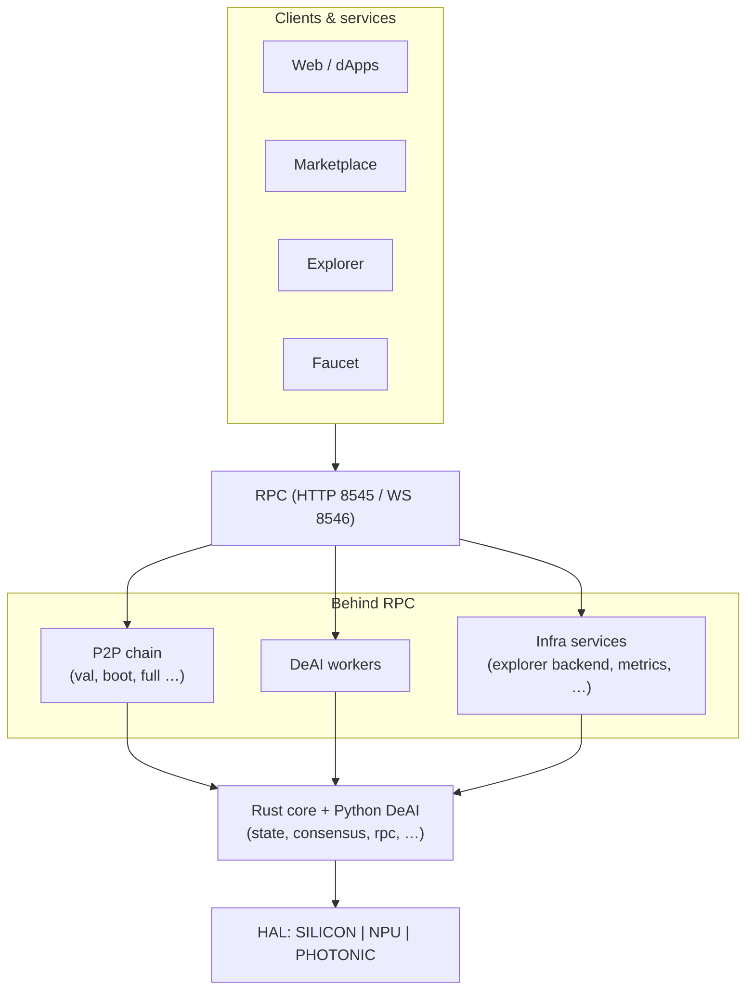

# Architecture Overview — Axionax Core Universe

Single entry point for **how the protocol is structured** in this repository: layers from users down to hardware, where code lives, and which docs to read next.

**Audience:** engineers onboarding to `axionax-core-universe`, reviewers, and operators who need a map before diving into RPC specs or runbooks.

---

## Contents

1. [Purpose & scope](#1-purpose--scope)  
2. [System stack](#2-system-stack)  
3. [Repository layout](#3-repository-layout)  
4. [Rust workspace (crates)](#4-rust-workspace-crates)  
5. [Network & node roles](#5-network--node-roles)  
6. [DeAI & compute](#6-deai--compute)  
7. [Hardware program (Monolith)](#7-hardware-program-monolith)  
8. [Product vision (pointer)](#8-product-vision-pointer)  
9. [Related documentation](#9-related-documentation)

---

## 1. Purpose & scope

| In scope here | Out of scope (see linked docs) |
|-----------------|--------------------------------|
| Logical layers and data flow | Every JSON-RPC method → [RPC_API.md](./RPC_API.md) |
| Folder ↔ responsibility | VPS runbooks, genesis day → repo `docs/`, [RUNBOOK.md](./RUNBOOK.md) |
| List of Rust workspace crates | Full API signatures → [API_REFERENCE.md](./API_REFERENCE.md) |

Canonical doc index for the whole repo: [AXIONAX_BIBLE.md](../../docs/AXIONAX_BIBLE.md).

---

## 2. System stack

Traffic flows **down** from clients; trust and execution anchor in **Rust core**, with **Python DeAI** for off-chain / worker compute and **HAL** for hardware backends.

### 2.1 Layer summary

| # | Layer | Responsibility |
|---|--------|----------------|
| L1 | **Clients** | Web, dApps, wallets, marketplace UIs |
| L2 | **Edge services** | Explorer (e.g. Blockscout), faucet, monitoring (Prometheus/Grafana) |
| L3 | **RPC** | JSON-RPC (HTTP/WebSocket); Ethereum-style and custom methods |
| L4 | **Chain & P2P** | Validators, bootnodes, full/light nodes; sync and block production |
| L5 | **Core (Rust)** | State, consensus, mempool, staking, governance, genesis, metrics |
| L6 | **DeAI (Python)** | Worker node, marketplace integration, optional optical / ML paths |
| L7 | **HAL** | SILICON (CPU/GPU), NPU (e.g. Hailo), PHOTONIC (simulation / roadmap) |

### 2.2 Ecosystem diagram

```
                         AXIONAX ECOSYSTEM (clients & services)
┌────────────┐ ┌────────────┐ ┌────────────┐ ┌────────────┐
│ Web / dApps│ │ Marketplace│ │ Explorer   │ │ Faucet     │
└─────┬──────┘ └─────┬──────┘ └─────┬──────┘ └─────┬──────┘
      └──────────────┴──────────────┴──────────────┘
                              │
                              ▼
                   ┌──────────────────────┐
                   │ RPC (8545 / 8546)   │
                   └──────────┬───────────┘
         ┌────────────────────┼────────────────────┐
         ▼                    ▼                    ▼
   ┌───────────┐        ┌───────────┐        ┌─────────────────┐
   │ P2P chain │        │ DeAI      │        │ Infra services  │
   │ (val,     │        │ workers   │        │ (explorer,      │
   │  boot,    │        │           │        │  metrics, etc.) │
   │  full…)   │        │           │        └─────────────────┘
   └─────┬─────┘        └─────┬─────┘
         └────────────────────┘
                              ▼
              ┌───────────────────────────────┐
              │ Rust core + Python DeAI       │
              │ (state, consensus, rpc, …)   │
              └───────────────┬───────────────┘
                              ▼
              ┌───────────────────────────────┐
              │ HAL: SILICON │ NPU │ PHOTONIC  │
              └───────────────────────────────┘
```

*Tip: use a **monospace** font in the editor so column alignment matches the diagram.*

### 2.3 Same diagram (Mermaid — renders on GitHub / many Markdown viewers)



---

## 3. Repository layout

Top-level map of **this monorepo** (paths relative to repo root).

| Path | Role |
|------|------|
| `core/` | **Cargo workspace root** — protocol crates under `core/core/`, `core/deai/`, `core/bridge/`, `core/tools/` |
| `core/deai/` | Python worker, HAL, RPC client helpers, tests |
| `core/photonic/` | Photonic / MK-II research notes (not a Cargo workspace member) |
| `ops/deploy/` | Dockerfiles, compose, nginx, monitoring, **public testnet:** `environments/testnet/public/` |
| `scripts/` | Readiness scripts, `load_test/`, optimize suite, security helpers |
| `docs/` | Launch, MetaMask, readiness, [AXIONAX_BIBLE.md](../../docs/AXIONAX_BIBLE.md) |
| `reports/` | Generated readiness / benchmark outputs (when committed or local) |
| `configs/` | Monolith / HYDRA sentinel & worker TOML examples |
| `tools/` | Root-level devtools (Python, analysis) |
| `hydra_manager.py` | HYDRA dual-core controller (MK-I tooling) |

**Build tip:** Node binary is built from workspace package `node` → `axionax-node`. Image build: `ops/deploy/Dockerfile` with context `core/`.

---

## 4. Rust workspace (crates)

Defined in `core/Cargo.toml`: **18 protocol crates** in `core/core/`, plus **`bridge/rust-python`** and **`tools/faucet`**.

### 4.1 Protocol & execution

| Crate | Role |
|-------|------|
| `blockchain` | Blocks, chain, mempool integration |
| `consensus` | PoPC; Proof-of-Light (simulation) |
| `crypto` | Primitives; **ECVRF** (schnorrkel) on production VRF paths |
| `network` | libp2p, gossip, capabilities (ASR / Monolith hints) |
| `state` | Persistent state (e.g. RocksDB) |
| `node` | Binary `axionax-node` — wires network, state, RPC, roles |
| `rpc` | JSON-RPC server, health, metrics hooks |
| `config` | Configuration loading |

### 4.2 Economics & coordination

| Crate | Role |
|-------|------|
| `staking` | Stake, delegate, slash |
| `governance` | Proposals, voting |
| `ppc` | Posted Price Controller (compute pricing) |
| `da` | Data availability (erasure coding) |
| `asr` | Auto-Selection Router (VRF-weighted worker selection) |
| `vrf` | VRF interfaces; prefer ECVRF stack in new code |

### 4.3 Observability, tooling & integration

| Crate | Role |
|-------|------|
| `events` | Internal event / pub-sub style hooks |
| `metrics` | Prometheus export |
| `cli` | CLI entrypoints |
| `genesis` | Genesis generation and chain parameters |
| `bridge/rust-python` | PyO3 bridge for Python ↔ Rust |
| `tools/faucet` | Rust faucet binary (deploy may use separate faucet image) |

---

## 5. Network & node roles

- **Chain participants:** validator, bootnode, full node, light node (as implemented).  
- **Off-chain / ops:** dedicated RPC service, explorer backend, faucet, monitoring.

Authoritative list and responsibilities: [NETWORK_NODES.md](./NETWORK_NODES.md).  
Sizing (CPU/RAM/disk): [NODE_SPECS.md](./NODE_SPECS.md).

---

## 6. DeAI & compute

| Component | Location / note |
|-----------|------------------|
| Worker process | `core/deai/worker_node.py` — jobs: inference, training, data processing |
| HAL | `core/deai/compute_backend.py` — **SILICON**, **NPU**, **PHOTONIC**, **HYBRID** |
| Marketplace | Contract-facing flows (register, jobs, results) — see DeAI docs |
| Worker selection | Rust **ASR** + **VRF** on-chain / protocol side |

Worker taxonomy: [MARKETPLACE_WORKER_NODES.md](./MARKETPLACE_WORKER_NODES.md).

---

## 7. Hardware program (Monolith)

| Gen | Codename | Focus | In repo (typical) |
|-----|----------|--------|-------------------|
| MK-I | Vanguard / Origin | Silicon + NPU (e.g. Hailo, RPi class) | HAL, HYDRA configs |
| MK-II | Prism | Path to photonic; simulation | Optical / PoL simulation code paths |
| MK-III | Ethereal | Photonic scale-out | Roadmap |
| MK-IV | Gaia | Long-term vision | Roadmap |

Detail: [MONOLITH_ROADMAP.md](./MONOLITH_ROADMAP.md).

---

## 8. Product vision (pointer)

High-level narrative (pillars, engines, phases): [PROJECT_ASCENSION.md](./PROJECT_ASCENSION.md).  
Security framing (Sentinels, self-sufficiency): [SENTINELS.md](./SENTINELS.md), [SELF_SUFFICIENCY.md](../../docs/SELF_SUFFICIENCY.md).

---

## 9. Related documentation

### Protocol & nodes

| Doc | Topic |
|-----|--------|
| [NETWORK_NODES.md](./NETWORK_NODES.md) | Node types |
| [NODE_SPECS.md](./NODE_SPECS.md) | Hardware sizing |
| [RPC_API.md](./RPC_API.md) | JSON-RPC catalog |
| [API_REFERENCE.md](./API_REFERENCE.md) | Deeper API reference |

### Security & operations

| Doc | Topic |
|-----|--------|
| [RUNBOOK.md](./RUNBOOK.md) | Incidents, restarts |
| [SENTINELS.md](./SENTINELS.md) | DeAI sentinel roles |

### Vision & hardware

| Doc | Topic |
|-----|--------|
| [PROJECT_ASCENSION.md](./PROJECT_ASCENSION.md) | Vision |
| [MONOLITH_ROADMAP.md](./MONOLITH_ROADMAP.md) | MK-I–IV |

### Repo-wide index

| Doc | Topic |
|-----|--------|
| [AXIONAX_BIBLE.md](../../docs/AXIONAX_BIBLE.md) | All books / entry points |

---

**Document:** `core/docs/ARCHITECTURE_OVERVIEW.md`  
**Last updated:** 2026-03
