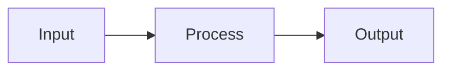

# Contributing to Axionax Documentation

> **Guidelines for writing and maintaining documentation**

**Last Updated**: May 3, 2026

---

## Quick Start

### Prerequisites

- Familiarity with Markdown syntax
- Understanding of Axionax domain separation (Web ↔ Core)
- Git workflow knowledge

### File Locations

| Type | Location | Purpose |
|------|----------|---------|
| Cross-cutting docs | `docs/` | Protocol-wide documentation |
| Web docs | `docs/web/` | Frontend, dApp, marketplace guides |
| Core docs | `docs/core/` | Blockchain, DeAI, node operations |
| Playbook | `docs/playbook/` | AI assistant guides |

---

## Documentation Standards

### File Naming

- Use `UPPERCASE.md` for main documents
- Use `lowercase.md` for supporting files
- Use hyphens `-` for spaces: `QUICK-START.md`

### Header Format

```markdown
# Document Title

> **Short description** — One line summary

**Last Updated**: YYYY-MM-DD  
**Version**: vX.Y.Z-status

---
```

### Content Structure

1. **Title** (H1)
2. **Short description** (blockquote)
3. **Metadata** (last updated, version)
4. **Table of Contents** (for docs > 100 lines)
5. **Body content** with clear sections
6. **See Also** section with links
7. **Footer** (last updated)

---

## Writing Style

### Language

- **Primary**: English (technical docs)
- **Secondary**: Thai (community guides allowed)
- **Code**: English only

### Tone

- Clear and concise
- Technical but accessible
- Use active voice: "Deploy the node" not "The node should be deployed"

### Formatting

| Element | Format | Example |
|---------|--------|---------|
| Code inline | `backticks` | `eth_chainId` |
| Code blocks | fenced with lang | ```json {...} ``` |
| File paths | `code` | `docs/README.md` |
| Emphasis | **bold** | **Important** |
| Parameters | *italic* | *address* |
| Tables | use pipes | \| Col1 \| Col2 \| |

---

## Domain Boundaries

> **CRITICAL**: Respect Web ↔ Core separation

### Web Domain (`apps/`)

- User interface guides
- Wallet integration
- Marketplace usage
- Frontend architecture

### Core Domain (`services/core/`)

- Consensus mechanism
- P2P networking
- DeAI worker setup
- Node operations

### Cross-cutting (`docs/`)

- Protocol architecture
- API references
- Tokenomics
- Roadmap

**Never** cross-reference internal implementation details between domains.

---

## Linking Rules

### Internal Links

```markdown
<!-- Same directory -->
[ROADMAP.md](./ROADMAP.md)

<!-- Parent directory -->
[README.md](../README.md)

<!-- Root docs -->
[Glossary](../../docs/glossary.md)
```

### External Links

```markdown
<!-- GitHub -->
[Repository](https://github.com/axionaxprotocol/axionax-monolith)

<!-- Website -->
[Protocol](https://axionax.org)
```

### Link Validation

Before committing:
1. Check all relative links work
2. Verify external links are accessible
3. Use full paths for cross-domain references

---

## Version Control

### Commit Messages

Format: `docs(scope): description`

```
docs(roadmap): update Phase 3 status to in-progress
docs(api): add staking endpoint examples
docs(glossary): add PoPC and VRF definitions
```

### Scopes

| Scope | Description |
|-------|-------------|
| `protocol` | Cross-cutting docs |
| `web` | Web universe docs |
| `core` | Core universe docs |
| `api` | API references |
| `playbook` | AI assistant guides |

### Pull Request Checklist

- [ ] Documentation builds without errors
- [ ] All links validated
- [ ] Version/date updated
- [ ] Follows style guide
- [ ] Reviewed for technical accuracy

---

## Diagrams

### Mermaid

Use Mermaid for flowcharts and sequence diagrams:

```markdown

```

### Images

- Store in `assets/` subdirectory
- Use relative paths: ``
- Optimize images before committing

---

## API Documentation

### Method Documentation

```markdown
### methodName

Brief description of what this method does.

**Parameters:**

| Name | Type | Description |
|------|------|-------------|
| param1 | string | Description |
| param2 | number | Description |

**Request:**

```json
{
  "jsonrpc": "2.0",
  "method": "methodName",
  "params": ["value1", 123],
  "id": 1
}
```

**Response:**

```json
{
  "jsonrpc": "2.0",
  "result": {...},
  "id": 1
}
```
```

---

## Review Process

1. **Self-review**: Check spelling, links, formatting
2. **Technical review**: Ensure accuracy with domain expert
3. **Editorial review**: Style and clarity check
4. **Merge**: After two approvals

---

## Templates

### New Document Template

```markdown
# Title

> **Short description**

**Last Updated**: YYYY-MM-DD

---

## Overview

Brief introduction.

## Section 1

Content...

## Section 2

Content...

---

## See Also

- [Related Doc](./RELATED.md)
- [Glossary](../glossary.md)

---

_Last updated: YYYY-MM-DD_
```

---

## Questions?

- Open an issue: [GitHub Issues](https://github.com/axionaxprotocol/axionax-monolith/issues)
- Discord: [#documentation](https://discord.gg/axionax)

---

_Last updated: May 3, 2026_
