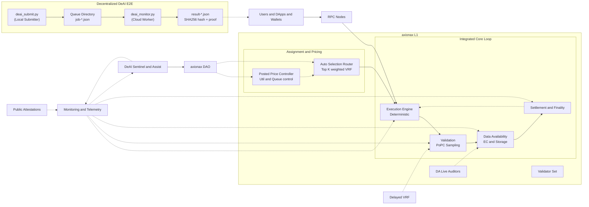
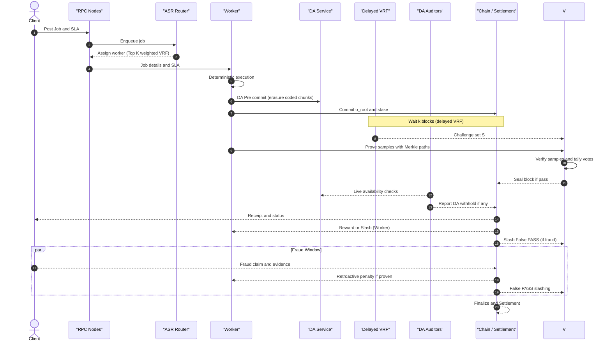
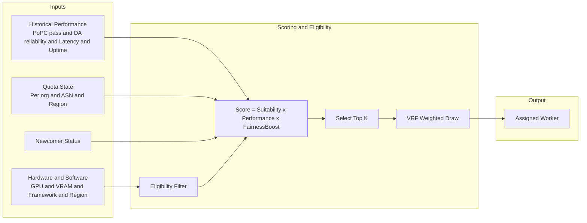
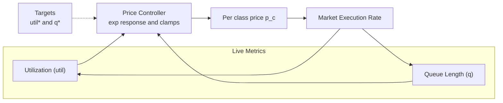
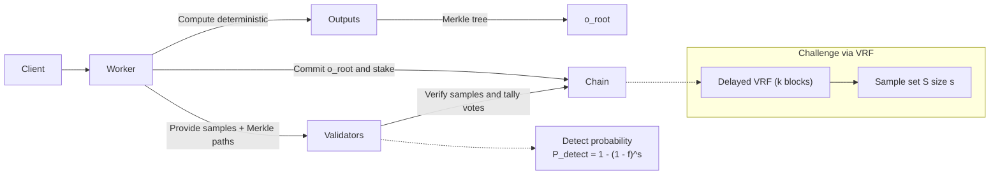
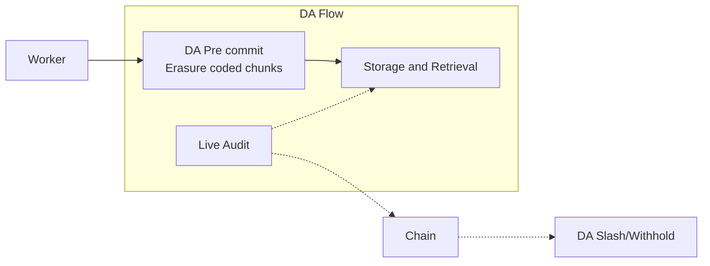
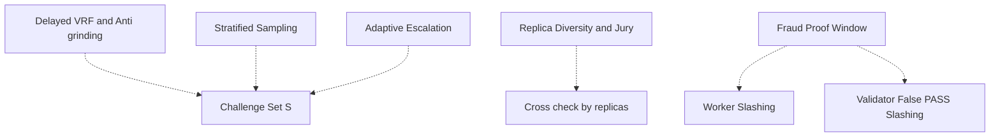
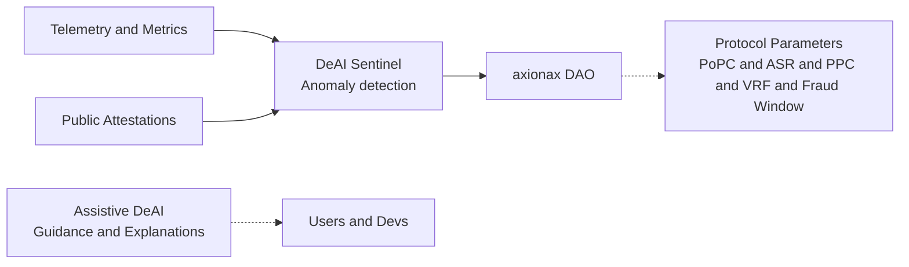

# axionax protocol — Architecture Overview v1.9.0 (Breakdown)

เอกสารนี้แยกสถาปัตยกรรม axionax ออกเป็นส่วนย่อยตามสรุปเวอร์ชัน 1.9.0 เพื่อให้เห็นภาพรวมและรายละเอียดของแต่ละองค์ประกอบได้ชัดเจนขึ้น

**Last Updated**: May 3, 2026 | **Protocol Version**: v1.9.0-testnet

- วงจร L1 แบบูรณาการ: Execute → Validate PoPC → Data Availability → Settlement
- ระบบตลาดที่ขับเคลื่อนโดยโปรโตคอล: ASR (K=64) และ Posted Price Controller
- ความปลอดภัยและความโปร่งใส: Delayed VRF (k≥2), DA Pre-commit, Stratified + Adaptive Sampling (s=1000), Replica Diversity, Fraud-Proof Window (3600s)
- ระบบ DeAI และการกำกับดูแลด้วย DAO
- พารามิเตอร์หลักและเวิร์ก์ v1.9.0 (✅ Fully Compliant - see ARCHITECTURE_COMPLIANCE_v1.9.0.md)
- **Decentralized DeAI**: submit → cloud worker → result hash + worker proof

---

## 0) High-Level Overview



หมายเหตุ
- Post → Assign → Execute → Commit and DA Pre-commit → Wait k → Challenge → Prove → Verify and Seal → Fraud Window → Finalize
- **Decentralized DeAI**: local submit → cloud worker (poll queue) → sandbox execute → result hash + worker proof → evidence package

---

## 1) Core Workflow v1.5 (ไม่มีประมูล)



หัวใจ: Post → Assign → Execute → Commit and DA Pre-commit → Wait k → Challenge → Prove → Verify and Seal → Fraud Window → Finalize

---

## 2) ASR — Auto-Selection Router



รายละเอียด
- Suitability: ความเข้ากันได้กับข้อกำหนดงาน
- Performance: ค่ากวามน่าเชื่อถือ (เช่น EWMA 7–30 วัน)
- FairnessBoost: จำกัดโควต้า, newcomer boost แบบ ε-greedy, และ anti-collusion ตาม org/ASN/ภูมิภาค
- พารามิเตอร์โดย DAO: K, q_max, ε (กำหนดโดย DAO)

---

## 3) Posted Price Controller (PPC)



สูตรปรับราคา (แนวคิด)
- ปรับราคาเพื่อรักษาความสมดุลระหว่าง utilization และ queue length
- พารามิเตอร์โดย DAO: α, β, ขอบเขต p_min ถึง p_max

---

## 4) PoPC — Proof of Probabilistic Checking



แนวคิดสำคัญ
- ลดต้นทุนตรวจสอบเหลือ O(s) ตัวอย่าง
- ปรับ s เพื่อเพิ่มความมั่นใจตามระดับความเสี่ยง
- PoPC sampling ผ่าน → ผ่านการตรวจสอบ

---

## 5) Data Availability (DA) และการตรวจสอบ



หลักการ
- ต้องพร้อมให้ดึงข้อมูลส่วนที่ท้าทายได้เสมอภายในหน้าต่างเวลา Δt_DA
- หากขาดความพร้อม มีบทลงโทษทันที

---

## 6) Security and Anti-Fraud Layer



หมายเหตุ
- สุ่มท้าทายหน่วงเวลา (k บล็อก) ลดโอกาส grinding
- ตรวจแบบแบ่งชั้นและเพิ่มตัวอย่างอัตโนมัติเมื่อเสี่ยงสูง
- ทำซ้ำส่วนกับความหลากหลายของ replicas เพื่อลดการสมรู้ร่วมกัน
- มีหน้าต่างพิสูจน์ Fraud (Δt_fraud ~3600s) สำหรับตรวจสอบย้อนหลัง

---

## 7) DeAI และ Governance



บทบาท
- DeAI Sentinel: ตรวจรับผิดปกติ เช่น การเล่นใหม่, capacity spoof, การฮั้ว
- Assistive DeAI: แนะนำค่าพารามิเตอร์ที่ปลอดภัย, อธิบายการตัดสินใจ, ตรวจสอบ determinism drift
- DAO: ปรับพารามิเตอร์สำคัญทั้งหมดของโปรโตคอล

---

## 8) พารามิเตอร์ที่แนะนำ (v1.9.0)

| พารามิเตอร์      |  ค่าที่แนะนำ |  คำอธิบาย                                   |
| --------------- | -------------: | ------------------------------------------ |
| s (samples)      |       600–1500 | จำนวนตัวอย่างที่ตรวจใน PoPC                    |
| β (redundancy)   |           2–3% | สัดส่วนงานที่ถูกทำซ้ำเพื่อ cross-check     |
| K (Top K)        |             64 | จำนวนผู้สมัครสูงสุดใน ASR ก่อนสุ่มด้วย VRF |
| q_max (quota)    | 10–15% / epoch | โควต้าสูงสุดต่อผู้ให้บริการ                |
| ε (epsilon)      |             5% | สัดส่วน exploration สำหรับผู้เล่นใหม่      |
| util*           |            0.7 | เป้าหมาย utilization ของ PoPC               |
| q\*              |      60 วินาที | เป้าหมายเวลารอของ PoPC                   |
| k (delay blocks) |      ≥ 2  บล็อก | หน่วงเวลา seed ของ VRF                     |
| Δt_fraud         |   ~3600 วินาที | ระยะเวลาของ Fraud-Proof Window             |
| False PASS (V)   |       ≥ 500 bp | อัตราโทษกับ Validator ที่โหวตผ่านงานโกง    |

---

## 9) อ้างอิงเวิร์ก์ v1.9.0 (ย่อ)

1. โพสต์งาน → 2. ASR Assign → 3. Execute → 4. Commit และ DA Pre-commit → 5. Wait k → 6. Challenge (VRF) → 7. Prove → 8. Verify และ Seal → 9. Fraud Window → 10. Finalize และ Settlement → 11. DeAI Monitor

---

## 10) Decentralized DeAI E2E (v1.9.0 NEW)

```mermaid
sequenceDiagram
    autonumber
    actor Local as "Local Submitter"
    participant Q as "Queue Directory"
    participant Cloud as "Cloud Worker (VPS)"
    participant Box as "Sandbox"

    Local->>Q: deai_submit.py → job-*.json
    Note over Q: SHA256(inputHash)

    Cloud->>Q: deai_monitor.py polls queue
    Cloud->>Box: execute_python_script(script)
    Note over Box: retry x N (exponential backoff)

    Box-->>Cloud: output → SHA256(output)
    Cloud->>Q: write result-*.json
    Note over Cloud: worker proof = SHA256(job_id + output)

    Local->>Q: read result-*.json
    Note over Local: evidence package (run.json, results.csv, details.log)
```

### Files
| File | Purpose |
|---|---|
| `services/core/core/deai/deai_submit.py` | Local submitter — writes job*.json to queue |
| `services/core/core/deai/deai_monitor.py` | Cloud worker — polls queue, executes in sandbox, writes result*.json |
| `services/core/core/deai/hello_deai.py` | Legacy single-machine demo (register + execute + hash) |
| `services/core/core/deai/RUNBOOK.md` | Runbook with architecture, CLI ref, job catalog |
| `services/core/reports/deai-queue/` | Evidence: job-*.json + result-*.json + run.json + results.csv + details.log |

### Evidence Package
```
deai-queue/
├── job-deai-001.json      # Submitted job (inputHash)
├── result-deai-001.json   # Worker result (output_hash, worker_proof)
├── run.json                # Machine-readable summary
├── results.csv            # Per-job rows
├── details.log            # Per-job execution log
└── incident-notes.md       # DoD verdict template
```

### DoD Checklist
| Requirement | Status |
|---|---|
| Python workload end-to-end main → worker | ✅ deai_submit.py → deai_monitor.py |
| Result hash captured (SHA256) | ✅ output_hash in result-*.json |
| Execution logs captured | ✅ details.log per-job, results.csv tabular |
| Retry/failure path captured | ✅ exponential backoff, exhausted → traceback |
| Evidence: demo script + runbook | ✅ RUNBOOK.md with architecture, CLI ref |
| Decentralized flow (submit → cloud → result back) | ✅ Sequence diagram above |

---

## 11) เคล็ดลับการเรน Mermaid บน GitHub

- ใช้ `<br/>` สำหรับขึ้นบรรทัดใหม่ในป้ายชื่อ
- หากมีวงเล็บในป้ายชื่อ ให้ครอบด้วย `<br/>Extra)` เพื่อให้ Mermaid render ได้ถูกต้อง
- หลีกเลี่ยงการใช้ emoji ในไฟล์นี้เพื่อป้องกันการพังของ diagram บน GitHub

---

_Last updated: May 3, 2026_  
_Evidence from: deai_submit.py + deai_monitor.py decentralized flow_

---

## Backend architecture (services/core)

**Backend (Rust core + Python DeAI):** see `docs/core/ARCHITECTURE_OVERVIEW.md`

- Decentralized DeAI E2E: `deai_submit.py` → queue → `deai_monitor.py` → result hash
- Frontend vs Backend: this file (v1.9.0) covers the Web Universe; `services/core/` covers the Core Universe.
